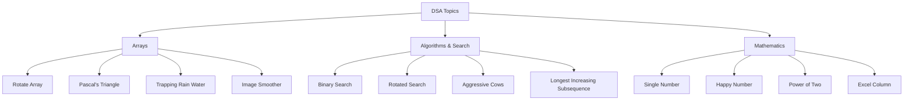

# DSA Solutions

My solutions to data structures and algorithms problems in Python.

  
  
  

## Topic Classification

## Problems List

1. **Rotate the array**: [q_01_Rotate_Array.py](./q_01_Rotate_Array.py)
2. **Minimise maximum of array**: [q_02_Minimize_Maximum_of_Array.py](./q_02_Minimize_Maximum_of_Array.py)
3. **Find the "Kth" max and min element of an array**: [q_03_Kth_Largest_Element_in_an_Array.py](./q_03_Kth_Largest_Element_in_an_Array.py)
4. **Given an array which consists of only 0, 1 and 2. Sort the array without using any sorting algo**: [q_04_Sort_Colors.py](./q_04_Sort_Colors.py)
5. **Rearrange array elements by sign**: [q_05_Rearrange_Array_Elements_by_Sign.py](./q_05_Rearrange_Array_Elements_by_Sign.py)
6. **Intersection of two arrays**: [q_06_Intersection_of_Two_Arrays.py](./q_06_Intersection_of_Two_Arrays.py)
7. **Write a program to cyclically rotate an array by one.**: [q_07_Rotate_Array_by_One.py](./q_07_Rotate_Array_by_One.py)
8. **find Largest sum contiguous Subarray**: [q_08_Maximum_Subarray.py](./q_08_Maximum_Subarray.py)
9. **Minimise the maximum difference between heights**: [q_09_Minimize_the_Heights_II.py](./q_09_Minimize_the_Heights_II.py)
10. **Minimum no. of Jumps to reach end of an array**: [q_10_Minimum_Jumps.py](./q_10_Minimum_Jumps.py)
11. **find duplicate in an array of N+1 Integers**: [q_11_Find_the_Duplicate_Number.py](./q_11_Find_the_Duplicate_Number.py)
12. **Merge 2 sorted arrays without using Extra space.**: [q_12_Merge_Sorted_Array.py](./q_12_Merge_Sorted_Array.py)
13. **Maximum Absolute sum of any sub-array**: [q_13_Maximum_Absolute_Sum_of_Any_Subarray.py](./q_13_Maximum_Absolute_Sum_of_Any_Subarray.py)
14. **Merge Intervals**: [q_14_Merge_Intervals.py](./q_14_Merge_Intervals.py)
15. **Next Permutation**: [q_15_Next_Permutation.py](./q_15_Next_Permutation.py)
16. **Count the Number of Inversions**: [q_16_Count_the_Number_of_Inversions.py](./q_16_Count_the_Number_of_Inversions.py)
17. **Best Time to Buy and Sell Stock**: [q_17_Best_Time_to_Buy_and_Sell_Stock.py](./q_17_Best_Time_to_Buy_and_Sell_Stock.py)
18. **Finding Pairs With a Certain Sum**: [q_18_Finding_Pairs_With_a_Certain_Sum.py](./q_18_Finding_Pairs_With_a_Certain_Sum.py)
19. **Common in 3 Sorted Arrays**: [q_19_Common_in_3_Sorted_Arrays.py](./q_19_Common_in_3_Sorted_Arrays.py)
20. **Subarray Sum Equals K**: [q_20_Subarray_Sum_Equals_K.py](./q_20_Subarray_Sum_Equals_K.py)
21. **Plus One**: [q_21_Plus_One.py](./q_21_Plus_One.py)
22. **Pascal's Triangle**: [q_22_Pascals_Triangle.py](./q_22_Pascals_Triangle.py)
23. **Single Number**: [q_23_Single_Number.py](./q_23_Single_Number.py)
24. **Majority Element**: [q_24_Majority_Element.py](./q_24_Majority_Element.py)
25. **Summary Ranges**: [q_25_Summary_Ranges.py](./q_25_Summary_Ranges.py)
26. **Third Maximum Number**: [q_26_Third_Maximum_Number.py](./q_26_Third_Maximum_Number.py)
27. **Missing Number**: [q_27_Missing_Number.py](./q_27_Missing_Number.py)
28. **Assign Cookies**: [q_28_Assign_Cookies.py](./q_28_Assign_Cookies.py)
29. **Trapping Rain Water**: [q_29_Trapping_Rain_Water.py](./q_29_Trapping_Rain_Water.py)
30. **Search in Rotated Sorted Array**: [q_30_Search_In_Rotated_Sorted_Array.py](./q_30_Search_In_Rotated_Sorted_Array.py)
31. **Sqrt(x)**: [q_31_Sqrt_x.py](./q_31_Sqrt_x.py)
32. **Maximum Average Subarray I**: [q_32_Maximum_Average_Subarray_I.py](./q_32_Maximum_Average_Subarray_I.py)
33. **Maximum Product of Three Numbers**: [q_33_Maximum_Product_of_Three_Numbers.py](./q_33_Maximum_Product_of_Three_Numbers.py)
34. **Image Smoother**: [q_34_Image_Smoother.py](./q_34_Image_Smoother.py)
35. **Longest Increasing Subsequence**: [q_35_Longest_Increasing_Subsequence.py](./q_35_Longest_Increasing_Subsequence.py)
36. **Degree of an Array**: [q_36_Degree_of_an_Array.py](./q_36_Degree_of_an_Array.py)
37. **Binary Search**: [q_37_Binary_Search.py](./q_37_Binary_Search.py)
38. **Climbing Stairs**: [q_38_Climbing_Stairs.py](./q_38_Climbing_Stairs.py)
39. **Excel Sheet Column Number**: [q_39_Excel_Sheet_Column_Number.py](./q_39_Excel_Sheet_Column_Number.py)
40. **Happy Number**: [q_40_Happy_Number.py](./q_40_Happy_Number.py)
41. **Power of Two**: [q_41_Power_of_Two.py](./q_41_Power_of_Two.py)
42. **Add Digits**: [q_42_Add_Digits.py](./q_42_Add_Digits.py)
43. **Ugly Number**: [q_43_Ugly_Number.py](./q_43_Ugly_Number.py)
44. **Aggressive Cows (SPOJ AGGRCOW)**: [q_44_Aggressive_Cows.py](./q_44_Aggressive_Cows.py)
45. **Split Array Largest Sum**: [q_45_Split_Array_Largest_Sum.py](./q_45_Split_Array_Largest_Sum.py)
46. **Find First and Last Position of Element in Sorted Array**: [q_46_Find_First_and_Last_Position_of_Element_in_Sorted_Array.py](./q_46_Find_First_and_Last_Position_of_Element_in_Sorted_Array.py)
47. **Find Minimum in Rotated Sorted Array**: [q_47_Find_Minimum_in_Rotated_Sorted_Array.py](./q_47_Find_Minimum_in_Rotated_Sorted_Array.py)
48. **Minimum Size Subarray Sum**: [q_48_Minimum_Size_Subarray_Sum.py](./q_48_Minimum_Size_Subarray_Sum.py)
49. **Missing Number**: [q_49_Missing_Number.py](./q_49_Missing_Number.py)
50. **Find the Duplicate Number**: [q_50_Find_the_Duplicate_Number.py](./q_50_Find_the_Duplicate_Number.py)
51. **Valid Perfect Square**: [q_51_Valid_Perfect_Square.py](./q_51_Valid_Perfect_Square.py)
52. **Minimum Common Value**: [q_52_Minimum_Common_Value.py](./q_52_Minimum_Common_Value.py)
53. **Find Target Indices After Sorting Array**: [q_53_Find_Target_Indices_After_Sorting_Array.py](./q_53_Find_Target_Indices_After_Sorting_Array.py)
54. **Check If N and Its Double Exist**: [q_54_Check_If_N_and_Its_Double_Exist.py](./q_54_Check_If_N_and_Its_Double_Exist.py)
55. **Count Negative Numbers in a Sorted Matrix**: [q_55_Count_Negative_Numbers_in_a_Sorted_Matrix.py](./q_55_Count_Negative_Numbers_in_a_Sorted_Matrix.py)
56. **Arranging Coins**: [q_56_Arranging_Coins.py](./q_56_Arranging_Coins.py)
57. **Find the Distance Value Between Two Arrays**: [q_57_Find_the_Distance_Value_Between_Two_Arrays.py](./q_57_Find_the_Distance_Value_Between_Two_Arrays.py)
58. **Find Smallest Letter Greater Than Target**: [q_58_Find_Smallest_Letter_Greater_Than_Target.py](./q_58_Find_Smallest_Letter_Greater_Than_Target.py)
59. **Find the Index of the First Occurrence in a String**: [q_59_Find_the_Index_of_the_First_Occurrence_in_a_String.py](./q_59_Find_the_Index_of_the_First_Occurrence_in_a_String.py)
60. **Counting Bits**: [q_60_Counting_Bits.py](./q_60_Counting_Bits.py)
61. **Integer Replacement**: [q_61_Integer_Replacement.py](./q_61_Integer_Replacement.py)
62. **Hamming Sort**: [q_62_Hamming_Sort.py](./q_62_Hamming_Sort.py)
63. **Make an Array**: [q_63_Make_an_Array.py](./q_63_Make_an_Array.py)
64. **Recursive Digit Sum**: [q_64_Recursive_Digit_Sum.py](./q_64_Recursive_Digit_Sum.py)
65. **The Power Sum**: [q_65_The_Power_Sum.py](./q_65_The_Power_Sum.py)
66. **Max Min**: [q_66_Max_Min.py](./q_66_Max_Min.py)
67. **Sorting Bubble Sort**: [q_67_Sorting_Bubble_Sort.py](./q_67_Sorting_Bubble_Sort.py)
68. **Selection Sort**: [q_68_Selection_Sort.py](./q_68_Selection_Sort.py)
69. **Single Number II**: [q_69_Single_Number_II.py](./q_69_Single_Number_II.py)
70. **Count Pairs**: [q_70_Count_Pairs.py](./q_70_Count_Pairs.py)
71. **Single Number II**: [q_71_Single_Number_II.py](./q_71_Single_Number_II.py)
72. **Count Pairs**: [q_72_Count_Pairs.py](./q_72_Count_Pairs.py)
73. **Palindrome Lover**: [q_73_Palindrome_Lover.py](./q_73_Palindrome_Lover.py)
74. **Min Bits**: [q_74_Min_Bits.py](./q_74_Min_Bits.py)
75. **Even Sum in Matrix**: [q_75_Even_Sum_in_Matrix.py](./q_75_Even_Sum_in_Matrix.py)
76. **Xor Pairs**: [q_76_Xor_Pairs.py](./q_76_Xor_Pairs.py)
77. **Count Coprime Subsequences**: [q_77_Count_Coprime_Subsequences.py](./q_77_Count_Coprime_Subsequences.py)
78. **Count Set Bits in 1 to N**: [q_78_Count_Set_Bits_in_1_to_N.py](./q_78_Count_Set_Bits_in_1_to_N.py)
79. **Power Set**: [q_79_Power_Set.py](./q_79_Power_Set.py)
80. **Bit Difference**: [q_80_Bit_Difference.py](./q_80_Bit_Difference.py)
81. **Search an Element in a Matrix**: [q_81_Search_an_Element_in_a_Matrix.py](./q_81_Search_an_Element_in_a_Matrix.py)
82. **Find Median in a Row Wise Sorted Matrix**: [q_82_Find_Median_in_a_Row_Wise_Sorted_Matrix.py](./q_82_Find_Median_in_a_Row_Wise_Sorted_Matrix.py)
83. **Find Row with Maximum No of 1s**: [q_83_Find_Row_with_Maximum_No_of_1s.py](./q_83_Find_Row_with_Maximum_No_of_1s.py)
84. **Print Elements in Sorted Order Using Row Column Wise Sorted Matrix**: [q_84_Print_Elements_in_Sorted_Order_Using_Row_Column_Wise_Sorted_Matrix.py](./q_84_Print_Elements_in_Sorted_Order_Using_Row_Column_Wise_Sorted_Matrix.py)
85. **Maximum Size Rectangle**: [q_85_Maximum_Size_Rectangle.py](./q_85_Maximum_Size_Rectangle.py)
86. **Find a Specific Pair in Matrix**: [q_86_Find_a_Specific_Pair_in_Matrix.py](./q_86_Find_a_Specific_Pair_in_Matrix.py)
87. **Rotate Matrix by 90 Degrees**: [q_87_Rotate_Matrix_by_90_Degrees.py](./q_87_Rotate_Matrix_by_90_Degrees.py)
88. **Kth Smallest Element in a Row Column Wise Sorted Matrix**: [q_88_Kth_Smallest_Element_in_a_Row_Column_Wise_Sorted_Matrix.py](./q_88_Kth_Smallest_Element_in_a_Row_Column_Wise_Sorted_Matrix.py)
89. **Common Elements in All Rows of a Given Matrix**: [q_89_Common_Elements_in_All_Rows_of_a_Given_Matrix.py](./q_89_Common_Elements_in_All_Rows_of_a_Given_Matrix.py)
90. **Find First and Last Positions of an Element in a Sorted Array**: [q_90_Find_First_and_Last_Positions_of_an_Element_in_a_Sorted_Array.py](./q_90_Find_First_and_Last_Positions_of_an_Element_in_a_Sorted_Array.py)
91. **Find a Fixed Point in a Given Array**: [q_91_Find_a_Fixed_Point_in_a_Given_Array.py](./q_91_Find_a_Fixed_Point_in_a_Given_Array.py)
92. **Search in a Rotated Sorted Array**: [q_92_Search_in_a_Rotated_Sorted_Array.py](./q_92_Search_in_a_Rotated_Sorted_Array.py)
93. **Square Root of an Integer**: [q_93_Square_Root_of_an_Integer.py](./q_93_Square_Root_of_an_Integer.py)
94. **Maximum and Minimum of an Array Using Minimum Number of Comparisons**: [q_94_Maximum_and_Minimum_of_an_Array_Using_Minimum_Number_of_Comparisons.py](./q_94_Maximum_and_Minimum_of_an_Array_Using_Minimum_Number_of_Comparisons.py)
95. **Optimum Location of Point to Minimize Total Distance**: [q_95_Optimum_Location_of_Point_to_Minimize_Total_Distance.py](./q_95_Optimum_Location_of_Point_to_Minimize_Total_Distance.py)
96. **Find the Repeating and the Missing**: [q_96_Find_the_Repeating_and_the_Missing.py](./q_96_Find_the_Repeating_and_the_Missing.py)
97. **Find Majority Element**: [q_97_Find_Majority_Element.py](./q_97_Find_Majority_Element.py)
98. **Searching in an Array Where Adjacent Differ by at Most K**: [q_98_Searching_in_an_Array_Where_Adjacent_Differ_by_at_Most_K.py](./q_98_Searching_in_an_Array_Where_Adjacent_Differ_by_at_Most_K.py)
99. **Find a Pair with a Given Difference**: [q_99_Find_a_Pair_with_a_Given_Difference.py](./q_99_Find_a_Pair_with_a_Given_Difference.py)

